# Laporan Modul 2: Dasar Pemrograman Java
**Mata Kuliah:** Parikum Desain Pattern
**Nama:** [NAYLA RAMADHANI]  
**NIM:** [2024573010041]  
**Kelas:** [TI / 2A]

----

## 1. Abstrak
#### mempelajari dasar-dasar pemrograman Java yang meliputi penggunaan variabel, tipe data, input-output, percabangan, dan perulangan. Java merupakan bahasa pemrograman berorientasi objek yang banyak digunakan dalam pengembangan aplikasi desktop, web, maupun mobile. Dalam praktikum ini mahasiswa mempelajari cara membuat program sederhana menggunakan Java serta memahami bagaimana struktur program bekerja.
konsep dasar seperti variabel, tipe data, struktur percabangan, dan perulangan merupakan dasar penting dalam pembuatan program. Dengan memahami konsep tersebut, mahasiswa dapat membuat program sederhana untuk menyelesaikan berbagai permasalahan komputasi.

## 2. Praktikum_1
### Praktikum 1 - Pengenalan Java dan Lingkungan Pengembangan
#### Dasar Teori
Java adalah bahasa pemrograman berorientasi objek yang populer dan banyak digunakan untuk pengembangan aplikasi desktop, web, dan mobile. Java menggunakan sintaks yang mirip dengan C++ tetapi dirancang untuk lebih mudah dipahami dan digunakan.
Untuk memulai pemrograman Java, Anda perlu:
1. JDK (Java Development Kit): Berisi compiler dan tools untuk mengembangkan program Java.
2. IDE (Integrated Development Environment): Seperti IntelliJ IDEA, Eclipse, atau NetBeans untuk menulis dan menjalankan kode.

#### Langkah Praktikum
1. Pastikan JDK dan Intellij IDE Community Edition sudah terinstal. Jika belum, kunjungi url berikut untuk mengunduh JDK Amazon Correto dan Intellij
2. Buka IDE dan buat sebuah project baru dengan ketentuan seperti berikut:
* Name: ti_design_pattern
* Location: disesuaikan
* Build system: Intellij
* JDK: Amazon Correto
* Hilangkan centang pada bagian add sample code
3. Buat sebuah package baru di dalam folder src dengan cara klik kanan pada folder src kemudian pilih New -> Package. Beri nama modul_1.
4. Buat Sebuah class didalam package modul_1 dengan cara klik kanan dan pilih New -> Java Class. Beri nama HelloWorld
6. Jalankan program dengan menekan tombol segitiga hijau seperti ditunjukkan pada lingkaran biru pada gambar dibawah ini.

#### Screenshoot Hasil
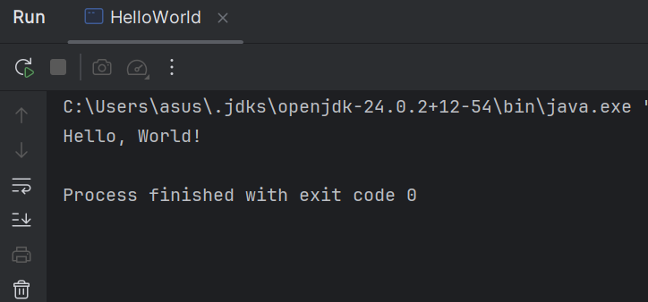

#### Analisa dan Pembahasan
Pada praktikum ini dilakukan pembuatan program sederhana menggunakan beberapa tipe data. Variabel digunakan untuk menyimpan informasi seperti nama, umur, dan tinggi badan.
Program menampilkan nilai dari setiap variabel menggunakan perintah System.out.println(). Dari praktikum ini dapat dipahami bahwa tipe data sangat penting karena menentukan jenis nilai yang dapat disimpan oleh suatu variabel.

### Praktikum 2 - Variabel dan Tipe Data
#### Dasar Teori
Variabel digunakan untuk menyimpan data dalam program. Setiap variabel memiliki tipe data yang menentukan jenis nilai yang dapat disimpan. Tipe data dasar di Java:
1. int: Bilangan bulat (contoh: 10, -5)
2. double: Bilangan desimal (contoh: 3.14, -0.5)
3. boolean: Nilai true atau false
4. char: Karakter tunggal (contoh: 'A', '1')
5. String: Teks (contoh: "Hello")

#### Langkah Praktikum
1. Buat sebuah class baru dengan nama Variable dan Jalankan program nya untuk melihat hasil.
#### Screenshoot Hasil
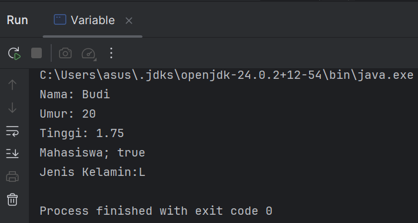

#### Latihan - DataDiri
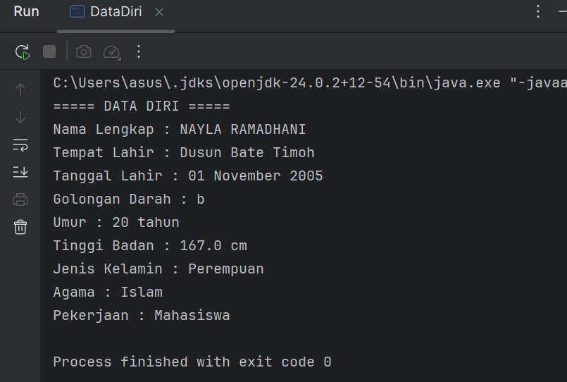

#### Analisa dan Pembahasan
1. Variabel digunakan untuk menyimpan data dalam program Java.
2. Setiap variabel memiliki tipe data tertentu seperti int, double, boolean, char, dan String.
3. Program Variable bertujuan untuk memperkenalkan penggunaan berbagai tipe data dasar dalam Java.
4. Program DataDiri merupakan implementasi sederhana penggunaan variabel untuk menyimpan dan menampilkan informasi pribadi.
5. Output program ditampilkan menggunakan method System.out.println() yang berfungsi menampilkan teks atau nilai variabel pada layar.

### Praktikum 3 - Operator dan Expressi
#### Dasar Teori
Operator digunakan untuk melakukan operasi pada variabel dan nilai. Jenis operator:
1. Aritmatika: +, -, *, /, %
2. Perbandingan: ==, !=, >, <, >=, <=
3. Logika: && (AND), || (OR), ! (NOT)

#### Langkah Praktikum
Buat sebuah class baru dengan nama Operator dan Jalankan program nya untuk melihat hasil.
#### Screenshoot Hasil
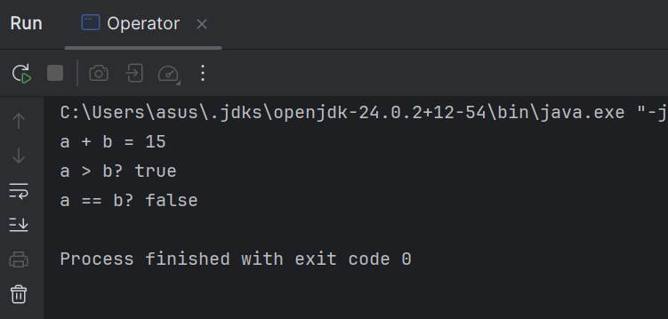

#### Latihan - LuasPersiPanjang
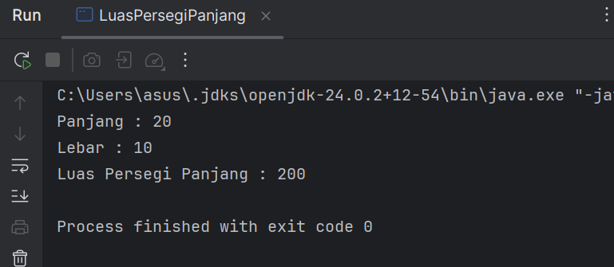

#### Analisa dan Pembahasan
1. Operator adalah simbol yang digunakan untuk melakukan operasi terhadap variabel atau nilai dalam program.
2. Java memiliki beberapa jenis operator seperti aritmatika, perbandingan, dan logika.
3. Program LuasPersegiPanjang menggunakan operator aritmatika * untuk menghitung luas.
4. Variabel digunakan untuk menyimpan nilai panjang, lebar, dan hasil luas.
5. Hasil perhitungan ditampilkan menggunakan System.out.println().

### Praktikum 4 - Percabangan (If-Else dan Switch-Case)
#### Dasar Teori
Percabangan digunakan untuk mengambil keputusan berdasarkan kondisi.
If-Else:
if (kondisi) {
// Blok kode jika kondisi true
} else {
// Blok kode jika kondisi false
}

Switch-Case:
switch (variabel) {
case nilai1:
// Blok kode jika variabel == nilai1
break;
case nilai2:
// Blok kode jika variabel == nilai2
break;
default:
// Blok kode jika tidak ada case yang sesuai
}

#### Langkah Praktikum
Buat sebuah class dan beri nama Percabangan dan Jalankan program nya untuk melihat hasil.
#### Screenshoot Hasil
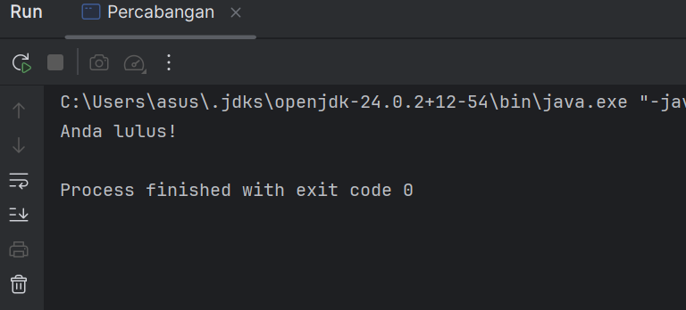

#### Latihan - LuasPersiPanjang
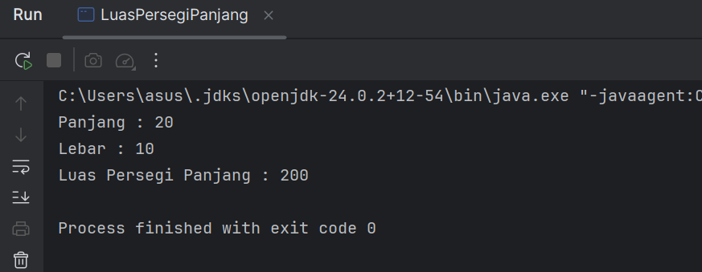

#### Analisa dan Pembahasan
1. Percabangan digunakan untuk mengambil keputusan dalam program berdasarkan kondisi tertentu.
2. Java memiliki beberapa bentuk percabangan seperti if-else dan switch-case.
3. Percabangan if-else digunakan untuk memeriksa kondisi logika.
4. Program latihan menggunakan operator modulus (%) untuk menentukan bilangan genap atau ganjil.
5. Jika hasil pembagian bilangan dengan 2 adalah 0, maka bilangan tersebut genap, sedangkan jika sisanya 1 maka bilangan tersebut ganjil.

### Praktikum 5 - Perulangan (For, While, Do-While)
#### Dasar Teori
Perulangan digunakan untuk mengulang blok kode.
For:
for (inisialisasi; kondisi; update) {
// Blok kode yang diulang
}

While:
while (kondisi) {
// Blok kode yang diulang
}
Do-While:
do {
// Blok kode yang diulang
} while (kondisi);

#### Langkah Praktikum
Buat sebuah class dengan nama Perulangan dan Jalankan program nya untuk melihat hasil.
#### Screenshoot Hasil
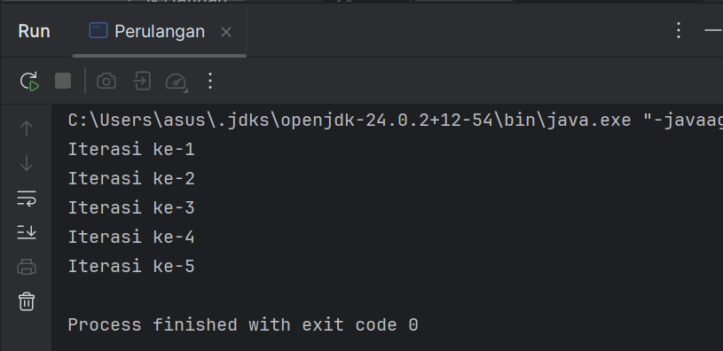

#### Latihan - GanjilFor
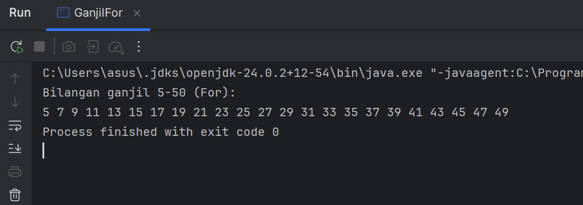

#### Latihan - GanjilWhile
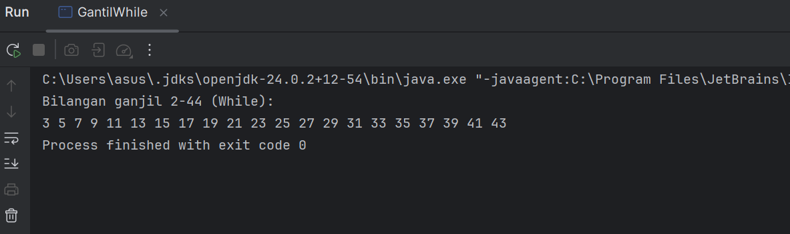
#### Latihan - GanjilDoWhile
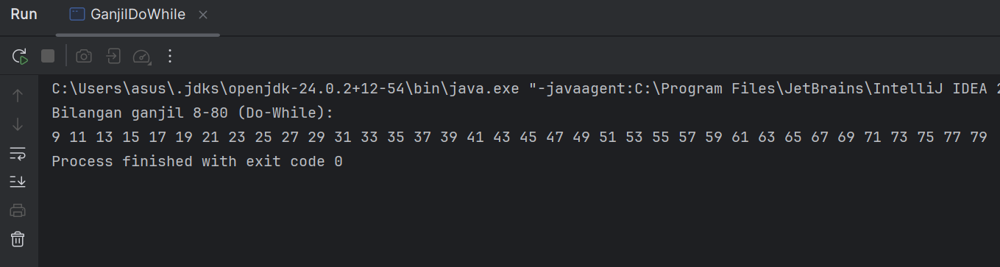

#### Analisa dan Pembahasan
1. Perulangan digunakan untuk menjalankan blok kode secara berulang selama kondisi tertentu masih terpenuhi.
2. Java memiliki tiga jenis perulangan utama yaitu for, while, dan do-while.
3. Perulangan for digunakan ketika jumlah iterasi sudah diketahui.
4. Perulangan while digunakan ketika perulangan bergantung pada kondisi tertentu.
5. Perulangan do-while menjalankan kode minimal satu kali sebelum memeriksa kondisi.
6. Program latihan berhasil mencetak bilangan ganjil dari 1 sampai 20 menggunakan ketiga jenis perulangan.

### Praktikum 6 - Practice Problem dan Solusinya
#### Dasar Teori
Practice Problem:
1. Buat program untuk menghitung faktorial dari suatu bilangan.
2. Buat program untuk mengecek apakah suatu bilangan adalah bilangan prima.
3. Buat program untuk mencetak pola segitiga menggunakan *.

#### Langkah Praktikum
1. Buat sebuah class baru dan beri nama Factorial dan isikan kode berikut. Kemudian jalankan untuk melihat hasilnya.
#### Screenshoot Hasil
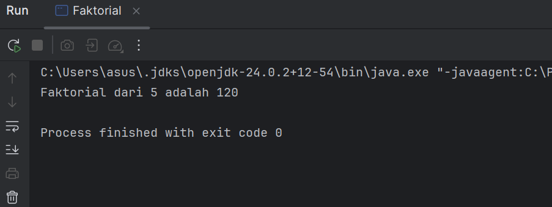

2. Buat sebuah class  dan beri nama Prima dan isikan kode berikut. Kemudian jalankan untuk melihat hasilnya.
#### Screenshoot Hasil
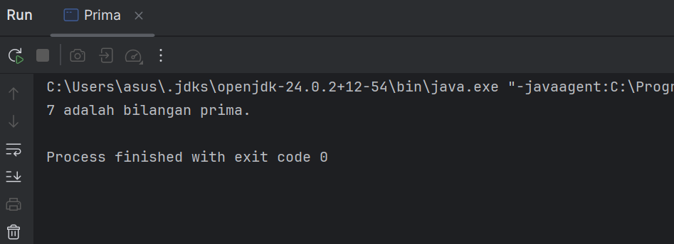

3. Buat sebuah class dan beri nama Segitiga dan isikan kode berikut. Kemudian jalankan untuk melihat hasilnya.
#### Screenshoot Hasil
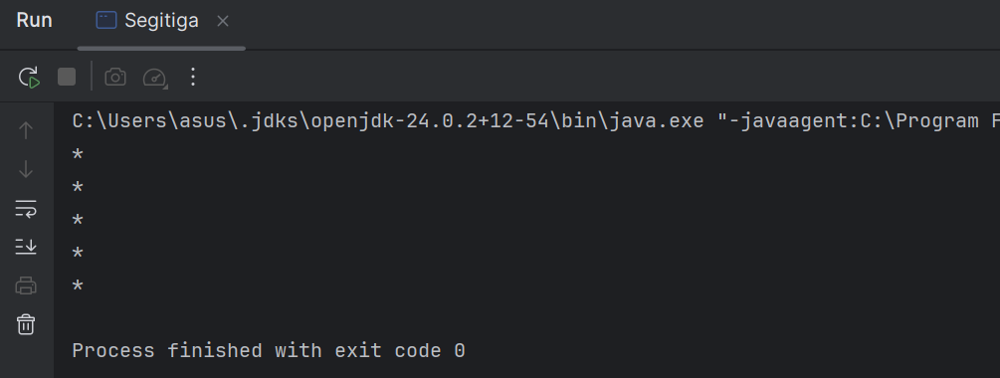

#### Analisa dan Pembahasan
1. Program Factorial digunakan untuk menghitung hasil perkalian bilangan dari 1 sampai suatu bilangan tertentu.
2. Program Prima digunakan untuk menentukan apakah suatu bilangan termasuk bilangan prima atau bukan.
3. Program Segitiga digunakan untuk mencetak pola bintang menggunakan konsep perulangan bersarang (nested loop).
4. Ketiga program tersebut melatih pemahaman tentang:
* variabe
* operator
* percabangan
* perulangan dalam Java.

---

## 3. Kesimpulan
1. Bahasa pemrograman Java memiliki struktur program yang jelas dan mudah dipahami.
2. Variabel dan tipe data digunakan untuk menyimpan berbagai jenis data dalam program.
3. Input dan output memungkinkan program berinteraksi dengan pengguna.
4. Percabangan digunakan untuk membuat keputusan berdasarkan kondisi tertentu.
5. Perulangan digunakan untuk menjalankan suatu perintah secara berulang.

---

## 5. Referensi
https://java.unisbadri.com/basic/variable/
https://rpl.upi.edu/memahami-konsep-dasar-pemrograman-java-untuk-pemula/
https://p2dpt.uma.ac.id/dasar-dasar-pemrograman-java
https://sis.binus.ac.id/bentuk-bentuk-perulangan-pada-java

---