# Laporan praktikum 2: Review Konsep Dasar OOP 
**Mata Kuliah:** [Parikum Desain Pattern]
**Nama:** [NAYLA RAMADHANI]  
**NIM:** [2024573010041]  
**Kelas:** [TI / 2A]

----

## 1. Abstrak
#### konsep dasar Object Oriented Programming (OOP) seperti class, object, attribute, method, akses modifier, setter-getter, dan constructor. OOP adalah cara pemrograman yang menggabungkan data dan fungsi dalam satu objek sehingga program lebih terstruktur dan mudah dipahami
## 2. Praktikum_2

### bagian_1 - Class dan Object
#### Dasar Teori
Class adalah blueprint atau cetakan untuk membuat objek. Class mendefinisikan atribut (variabel) dan method (fungsi) yang dimiliki oleh objek.
Object adalah instance dari class. Object memiliki state (nilai dari atribut) dan behavior (method).

#### Langkah Praktikum
1. Buka project pada praktikum sebelumnya menggunakan intellij IDEA
2. Buat sebuah package baru di dalam folder src dengan cara klik kanan pada folder src kemudian pilih New -> Package. Beri nama Praktikum_2.
3. Buat Sebuah package baru lagi didalam package praktikum_2  Beri nama bagian_1
4. Kemudian buat sebuah class baru dengan nama Mahasiswa 
5. Selanjutnya, buat sebuah class baru dengan nama Main 
6. Jalankan dan lihat hasilnya.

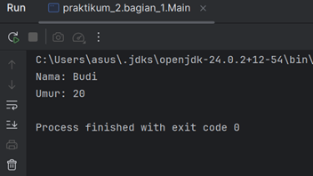

#### Latihan_1 -  Buku
class Buku membantu memahami bahwa object bisa dibuat lebih dari satu dan masing-masing memiliki data sendiri.
1. Buatlah class Buku dengan atribut judul dan pengarang.
2. Buat object dari class Buku dan isi nilai atributnya.
3. Tampilkan nilai atribut tersebut.

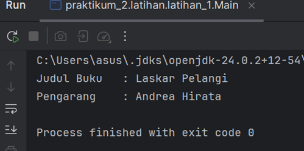

#### Analisa dan Pembahasan
Pada bagian ini, dipelajari bahwa class merupakan cetakan, sedangkan object adalah hasil dari cetakan tersebut
Class = Mahasiswa
Object = Budi
Setiap object bisa memiliki nilai atribut yang berbeda walaupun berasal dari class yang sama. Hal ini menunjukkan bahwa OOP sangat fleksibel dalam menyimpan data.

### bagian_2 - Attribute dan Method
#### Dasar Teori
Attribute adalah variabel yang dimiliki oleh class atau object.
Method adalah fungsi atau perilaku yang dimiliki oleh class atau object.

#### Langkah Praktikum
1. Buat Sebuah package baru lagi didalam package praktikum_2 Beri nama bagian_2
2. Kemudian buat sebuah class baru dengan nama Kalkulator 
3. Kemudian buat sebuah class baru dengan nama Main 
4. Jalankan program untuk melihat hasilnya.

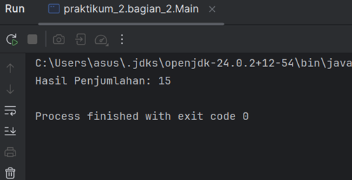

#### Latihan_2 - Lingkaran
jariJari = attribute
hitungLuas() = method
Dengan adanya method, program menjadi lebih dinamis karena bisa melakukan perhitungan langsung dari data yang ada.
1. Buat class Lingkaran dengan atribut jariJari.
2. Tambahkan method hitungLuas() yang mengembalikan nilai luas lingkaran.
3. Buat object dari class Lingkaran dan panggil method hitungLuas().

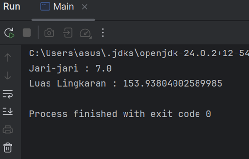

#### Analisa dan Pembahasan
Pada bagian ini dipahami bahwa:
Attribute = data
Method = aksi
Method membuat object tidak hanya menyimpan data, tetapi juga bisa melakukan sesuatu .

### bagian_3 - Akses Modifier
#### Dasar Teori
Akses Modifier menentukan tingkat akses dari class, atribut, atau method.
Jenis akses modifier:
* public : Dapat diakses dari mana saja.
* private : Hanya dapat diakses dalam class yang sama.
* protected : Dapat diakses dalam package yang sama dan subclass.
* default : Hanya dapat diakses dalam package yang sama.

### Langkah Praktikum 
1. Buat Sebuah package baru lagi didalam package praktikum_2 Beri nama bagian_3
2. Kemudian buat sebuah class baru dengan nama AksesModifier 
3. Kemudian buat sebuah class baru dengan nama Main
4. Jalankan program untuk melihat hasilnya.

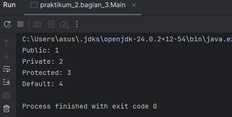

#### Latihan_3 - AkunBank
AkunBank, ketika saldo dibuat private, maka tidak bisa diakses langsung dari luar class. Ini menunjukkan pentingnya menjaga keamanan data dalam program.
Konsep ini disebut encapsulation, yaitu menyembunyikan data agar tidak sembarangan diubah.
1. Buat class AkunBank dengan atribut saldo (private) dan method tampilkanSaldo() (public).
2. Coba akses atribut saldo langsung dari luar class.

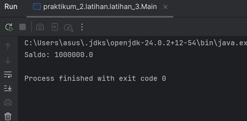

#### Analisa dan Pembahasan
Akses modifier digunakan untuk mengatur siapa yang boleh mengakses data.
Misalnya:
private → hanya bisa di dalam class
public → bisa diakses dari mana saja

### bagian_4 - Setter dan Getter
#### Dasar Teori
Setter adalah method untuk mengubah nilai atribut.
Getter adalah method untuk mengambil nilai atribut.
Setter dan Getter digunakan untuk mengakses atribut yang memiliki akses modifier private.

#### Langkah Praktikum
1. Buat Sebuah package baru lagi didalam package praktikum_2 Beri nama bagian_4
2. Kemudian buat sebuah class baru dengan nama Mobil 
3. Kemudian buat sebuah class baru dengan nama Main 
4. Jalankan program untuk melihat hasilnya.

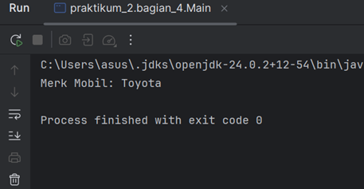

#### Latihan_4 - Mahasiswa
Mahasiswa, penggunaan setter dan getter membantu mengatur data seperti nama dan NIM agar tidak diubah sembarangan.
1. Buat class Mahasiswa dengan atribut nama (private) dan nim (private).
2. Buat setter dan getter untuk kedua atribut tersebut.
3. Buat object dari class Mahasiswa dan gunakan setter untuk mengisi nilai atribut.

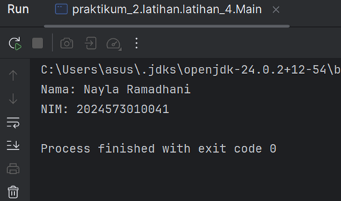

#### Analisa dan Pembahasan
Setter dan getter digunakan untuk mengakses atribut private dengan cara yang lebih aman.
Setter → untuk mengisi atau mengubah data
Getter → untuk mengambil data
Dengan cara ini, data tetap terlindungi tetapi masih bisa digunakan.

### Praktikum 5 - Constructor
#### Dasar Teori
Constructor adalah method khusus yang dipanggil saat object dibuat.
Jenis constructor:
* Default Constructor : Tanpa parameter.
* Parameterized Constructor : Dengan parameter.
* Constructor Overloading : Beberapa constructor dengan parameter berbeda.

#### Langkah praktikum
1. Buat Sebuah package baru lagi didalam package praktikum_2 Beri nama bagian_5
2. Kemudian buat sebuah class baru dengan nama Person 
3. Kemudian buat sebuah class baru dengan nama Main 
4. Jalankan program untuk melihat hasilnya.

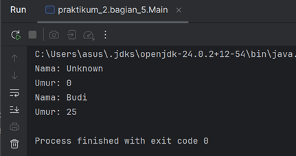

#### Latihan - Barang
1. Buat class Barang dengan atribut namaBarang dan harga.
2. Buat default constructor dan parameterized constructor.
3. Buat object dari class Barang menggunakan kedua constructor tersebut.

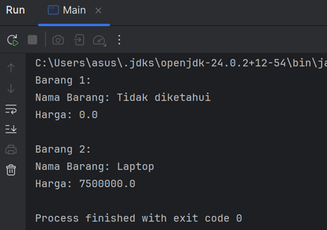

#### Analisa dan Pembahasan
Constructor digunakan untuk memberikan nilai awal saat object dibuat.
Ada dua jenis:
* Default constructor → tanpa parameter
* Parameterized constructor → dengan parameter
Dengan constructor, object langsung memiliki nilai tanpa harus diisi satu per satu. Ini membuat program lebih cepat dan efisien.

### bagian_6 - Sistem Manajemen Perpustakaan Sederhana
#### Dasar Teori
program konsol sederhana yang mengimplementasikan seluruh konsep yang telah dibahas sebelumnya, yaitu class, object, attribute, method, akses modifier, setter-getter, dan constructor. Program ini adalah sistem manajemen perpustakaan sederhana yang memungkinkan pengguna untuk menambahkan buku, menampilkan daftar buku, dan mencari buku berdasarkan judul.

#### Langkah Praktikum
1. Buat Sebuah package baru lagi didalam package praktikum_2 Beri nama bagian_6
2. Kemudian buat sebuah class baru dengan nama Buku 
3. Kemudian buat sebuah class baru dengan nama Perpustakaan 
4. Kemudian buat sebuah class baru dengan nama Main 
5. Jalankan program untuk melihat hasilnya.

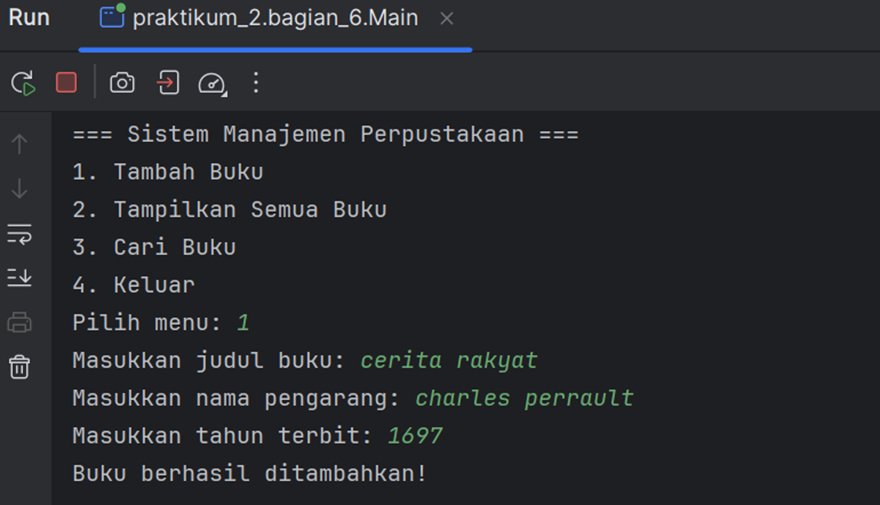

#### Analisa dan Pembahasan
Pada bagian ini, semua konsep OOP digabungkan dalam satu program.
Program perpustakaan menunjukkan bahwa:
* Class digunakan untuk membuat struktur
* Object digunakan untuk menyimpan data buku
* Method digunakan untuk menambah dan menampilkan data
Hal ini membuktikan bahwa OOP sangat membantu dalam membuat program yang terorganisir dan mudah dikembangkan.

---

## 3. Kesimpulan
1. OOP adalah metode pemrograman yang berorientasi pada objek.
2. Class dan object merupakan dasar utama dalam OOP.
3. Attribute dan method membuat object memiliki data dan fungsi.
4. Akses modifier membantu menjaga keamanan data.
5. Setter dan getter mempermudah pengelolaan atribut private.
6. Constructor mempermudah inisialisasi object.
7. OOP membuat program lebih rapi, mudah dipahami, dan mudah dikembangkan.

---

## 5. Referensi
1. Duniailkom. Pengertian Class, Object, Property dan Method dalam OOP Java. https://www.duniailkom.com/tutorial-oop-java-pengertian-class-object-property-dan-method/
2. Agus Suratna. Tutorial Java: Pengertian Class, Object, Property dan Method. https://agussuratna.net/2023/02/tutorial-java-pengertian-class-object-property-dan-method-dalam-pemrograman-berorientasi-obyek/
3. Onero Solutions. Apa Itu Method dalam OOP. https://onero.id/insight/detail/method/
4. Binus University. Introduction to Object Oriented Programming. https://sis.binus.ac.id/2019/02/07/introduction-to-object-oriented-programming/
5. HIMSISFO Binus. Pengertian Method, Class dan Object dalam OOP. https://student-activity.binus.ac.id/himsisfo/2016/07/pengertian-methode-class-dan-objek-dalam-oop/
6. Duniailkom. Pengertian Class dan Object dalam OOP PHP. https://www.duniailkom.com/tutorial-belajar-oop-php-pengertian-class-object-property-dan-method/
7. Markey. Pengertian Object, Class, Method, dan Property. https://markey.id/blog/development/pengertian-object
8. ITBOX. Pengertian Class dan Object dalam OOP Java. https://dev.itbox.id/blog/class-dan-object-dalam-oop-java
9. Petani Kode. Tutorial Dasar OOP Java untuk Pemula. https://www.petanikode.com/java-oop/

---