# Laporan praktikum 3: Review 4 Pillar OOP 
**Mata Kuliah:** [Parikum Desain Pattern]
**Nama:** [NAYLA RAMADHANI]  
**NIM:** [2024573010041]  
**Kelas:** [TI / 2A]

----

## 1. Abstrak
#### OOP merupakan paradigma pemrograman yang berfokus pada objek sebagai representasi dari data dan fungsi dalam sebuah program.
Dalam praktikum ini, dipelajari beberapa konsep utama OOP seperti class dan object, encapsulation, inheritance, polymorphism, abstraction, serta composition. Konsep-konsep tersebut diterapkan melalui pembuatan berbagai class dan program sederhana menggunakan IntelliJ IDEA.
Hasil dari praktikum menunjukkan bahwa penggunaan OOP dapat membuat program menjadi lebih terstruktur, modular, mudah dikembangkan, dan mudah dipelihara. OOP juga membantu dalam mengurangi duplikasi kode serta meningkatkan efisiensi dalam pengembangan perangkat lunak.

## 2. Praktikum_2
### bagian_1 - Pengenalan OOP dan Class-Object
#### Dasar Teori
Object-Oriented Programming (OOP) adalah paradigma pemrograman yang berorientasi pada objek, di mana setiap objek merepresentasikan entitas dunia nyata yang memiliki atribut (data) dan method (fungsi).
Dalam OOP, terdapat dua konsep dasar utama, yaitu:
* Class: cetak biru (blueprint) yang digunakan untuk membuat objek
* Object: instance dari class yang memiliki atribut dan method
Class digunakan untuk mendefinisikan struktur dan perilaku objek, sedangkan object digunakan untuk menjalankan fungsi dari class tersebut. Dengan pendekatan ini, program menjadi lebih terstruktur dan mudah dikembangkan.

#### Langkah Praktikum
1. Buka project pada praktikum sebelumnya menggunakan IntelliJ IDEA.
2. Buat package baru dengan nama praktikum_2.
3. Buat package lagi di dalamnya dengan nama bagian_1.
4. Buat class Mahasiswa.
5. Tambahkan atribut dan method pada class tersebut.
6. Buat class Main untuk menjalankan program.
7. Jalankan program dan amati hasilnya.

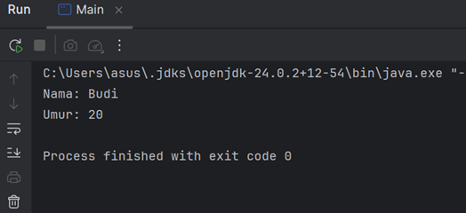

#### Latihan -  BUKU
1. atribut pada class Motor dibuat private agar tidak bisa diakses langsung. Untuk mengakses dan mengubah data digunakan method getter dan setter.
2. Getter digunakan untuk mengambil nilai, sedangkan setter digunakan untuk mengubah nilai atribut.

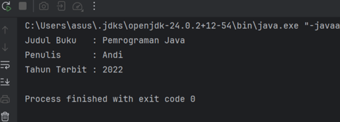

#### Analisa dan Pembahasan
dilakukan pembuatan class Mahasiswa dan object dari class tersebut.

Hasil analisa:
1. Class digunakan sebagai template untuk mendefinisikan atribut dan method
2. Object digunakan untuk menjalankan fungsi dari class
3. Program menjadi lebih terstruktur dibandingkan metode prosedural
Praktikum ini merupakan dasar penting sebelum mempelajari konsep OOP lainnya.

### bagian_2 - Encapsulation (Enkapsulasi)
#### Dasar Teori
Encapsulation adalah konsep OOP yang digunakan untuk menyembunyikan data (atribut) dan hanya memberikan akses melalui method tertentu. Tujuannya adalah untuk melindungi data dari akses langsung dan menjaga integritasnya.
Encapsulation biasanya diterapkan dengan:
* Access modifier (private, public, protected)
* Method getter dan setter
Dengan encapsulation, data dalam class tidak dapat diubah secara sembarangan, sehingga program menjadi lebih aman dan terkontrol.

#### Langkah Praktikum
1. Buat package baru bagian_2 di dalam praktikum_2.
2. Buat class Mahasiswa.
3. Ubah atribut menjadi private.
4. Tambahkan method getter dan setter.
5. Buat class Main untuk mengakses data melalui getter-setter.
6. Jalankan program dan lihat hasilnya.

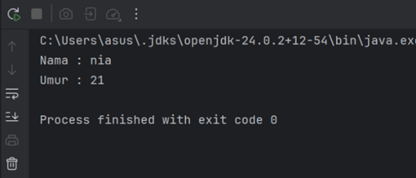

#### Latihan - MOTOR
atribut pada class Motor dibuat private agar tidak bisa diakses langsung. Untuk mengakses dan mengubah data digunakan method getter dan setter.
Getter digunakan untuk mengambil nilai, sedangkan setter digunakan untuk mengubah nilai atribut

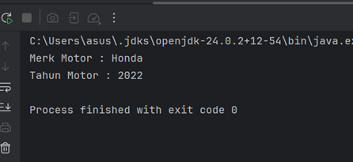

#### Analisa dan Pembahasan
Pada praktikum ini digunakan access modifier seperti private, public, dan protected.
Hasil analisa:
* Data menjadi lebih aman
* Menghindari perubahan data secara langsung
* Mempermudah pengelolaan data
Encapsulation sangat penting dalam menjaga integritas data dalam program.

### bagian_3 - Inheritance (Pewarisan) dan Composition (Komposisi)
#### Dasar Teori
Inheritance adalah proses pewarisan atribut dan method dari superclass ke subclass. Hubungan ini disebut “is-a”.
Composition adalah hubungan antar class dengan konsep “has-a”, di mana sebuah class memiliki object dari class lain.

#### Inheritance (Pewarisan)
Inheritance adalah mekanisme di mana sebuah class (subclass/child class) mewarisi atribut dan metode dari class lain (superclass/parent class). Inheritance menggambarkan hubungan "is-a" (adalah). Misalnya, Kucing adalah Hewan.

Ciri-Ciri Inheritance:
* Menggunakan keyword extends.
* Subclass mewarisi semua atribut dan metode dari superclass (kecuali yang private).
* Subclass dapat menambahkan atribut dan metode baru, atau meng-override metode yang ada.
* Mendukung hierarki class (class dapat mewarisi dari satu superclass).

#### Langkah Praktikum
1. Buat package baru dengan nama bagian_3.
2. Buat sub-package pewarisan.
3. Buat class Kendaraan sebagai superclass.
4. Tambahkan atribut dan method pada class Kendaraan.
5. Buat class Mobil sebagai subclass dengan menggunakan keyword extends.
6. Tambahkan atribut atau method tambahan pada class Mobil.
7. (Opsional) Lakukan overriding method jika diperlukan.
8. Buat class Main untuk menjalankan program.
9. Jalankan program dan amati bahwa subclass mewarisi atribut dan method dari superclass.

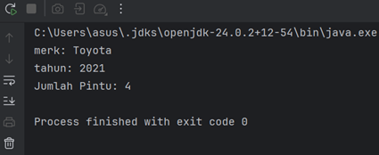

#### Composition (Komposisi)
Composition adalah mekanisme di mana sebuah class terdiri dari objek-objek dari class lain. Ini menggambarkan hubungan "has-a" (memiliki). Misalnya, Mobil memiliki Mesin. Composition memungkinkan kita untuk membangun class yang kompleks dengan menggabungkan objek-objek yang lebih sederhana.
Ciri-Ciri Composition:
* Menggunakan instance variabel dari class lain.
* Tidak ada keyword khusus, hanya menggunakan objek sebagai atribut.
* Lebih fleksibel daripada inheritance karena tidak terikat pada hierarki class.
* Mendukung reuseability tanpa perlu mewarisi class.

### Langkah Praktikum Composition
1. Membuat sub-package komposisi.
2. Membuat class Mesin.
3. Membuat class Mobil.
4. Menambahkan object Mesin sebagai atribut dalam class Mobil.
5. Membuat class Main.
6. Menjalankan program.

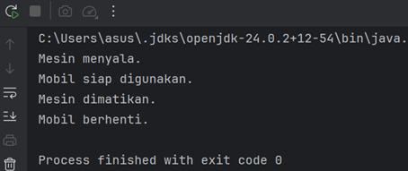

#### Latihan - LAPTOP
Pada latihan ini dibuat class Laptop yang memiliki komponen Processor dan RAM. Class Processor memiliki method jalankan(), sedangkan RAM memiliki method baca() dan tulis().
Laptop menggunakan object dari kedua class tersebut untuk menjalankan fungsi. Hal ini menunjukkan konsep composition (has-a), yaitu sebuah class memiliki object dari class lain

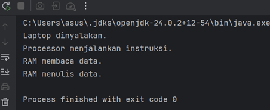

### Langkah praktikum main java
1. di dalam package bagian_3, buat sebuah class baru dan beri nama main dan isikan kode berikut
2. jalankan program

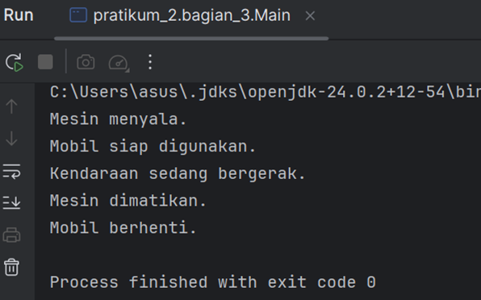

#### Analisa dan Pembahasan
Inheritance:
* Mengurangi duplikasi kode
* Mempermudah pengembangan program
* Contoh: Mobil adalah Kendaraan
Composition:
* Lebih fleksibel dibanding inheritance
* Memungkinkan kombinasi object
* Contoh: Mobil memiliki Mesin

### bagian_4 - Polymorphism (Polimorfisme)
#### Dasar Teori
Polymorphism adalah konsep OOP yang memungkinkan suatu method memiliki banyak bentuk. Kata “poly” berarti banyak dan “morph” berarti bentuk.
Polymorphism dibagi menjadi dua jenis:
1. Method Overriding
* Terjadi ketika subclass mengganti implementasi method dari superclass
* Digunakan dalam inheritance
2. Method Overloading
* Terjadi ketika terdapat beberapa method dengan nama sama tetapi parameter berbeda dalam satu class
* Polymorphism membuat program menjadi lebih fleksibel dan memungkinkan penggunaan method yang sama dengan perilaku yang berbeda.

#### Langkah Praktikum
1. Buat package bagian_4.
2. Buat sub-package overriding.
3. Buat class Hewan.
4. Buat class Kucing dan Anjing yang mewarisi Hewan.
5. Override method pada subclass.
6. Buat class Main untuk menjalankan program

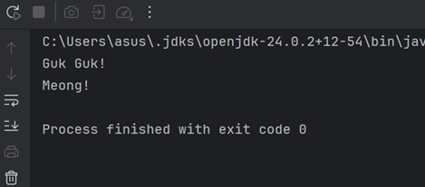

1. Method Overloading
Method overloading terjadi ketika sebuah class memiliki beberapa method dengan nama yang sama tetapi parameter yang berbeda (baik jumlah atau tipe parameternya). Method overloading digunakan untuk meningkatkan fleksibilitas dengan menyediakan beberapa cara untuk memanggil method yang sama.

2. Aturan Method Overloading:
* Method harus memiliki nama yang sama.
* Parameter harus berbeda (jumlah atau tipe).
* Return type bisa sama atau berbeda (tidak mempengaruhi overloading).
* Access modifier bisa sama atau berbeda.

#### Langkah Praktikum
1. Buat sub-package overloading.
2. Buat class Kalkulator.
3. Buat beberapa method dengan nama sama tetapi parameter berbeda.
4. Buat class Main.
5. Jalankan program.

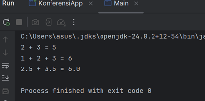

Overriding adalah
* mengganti method dari class induk ke class anak
* nama & parameter harus sama
* butuh inheritance
* terjadi saat program berjalan (runtime)
Overloading adalah
* membuat method dengan nama sama tapi parameter berbeda
* dalam satu class
* tidak perlu inheritance
* terjadi saat compile (compile-time)

#### Latihan1- Overriding

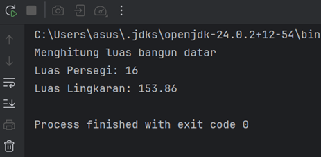

#### Latihan2- Overloading

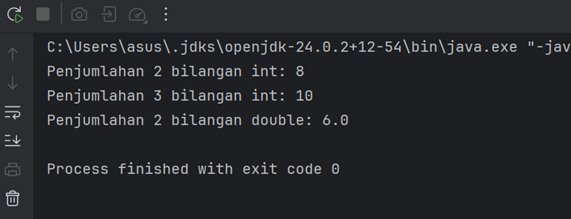

#### Analisa dan Pembahasan
Hasil analisa:
* Overriding digunakan pada inheritance
* Overloading digunakan dalam satu class
* Program menjadi lebih fleksibel dan dinamis
Polymorphism membantu dalam meningkatkan efisiensi dan keterbacaan kode.

### bagian_5 - Abstraction (Abstraksi) | Abstract Class dan Interface
#### Dasar Teori
Abstract class adalah class yang tidak dapat diinstansiasi secara langsung dan digunakan sebagai dasar bagi class lain. Abstract class dapat berisi:
* Method abstrak (tanpa implementasi)
* Method konkret (dengan implementasi)
* Atribut (state)
* Constructor
Abstract class digunakan ketika beberapa class memiliki hubungan yang erat dan berbagi sifat serta perilaku yang sama.

#### Langkah praktikum
1. Buat package bagian_5.
2. Buat sub-package abstrak.
3. Buat abstract class Hewan.
4. Buat class Kucing dan Anjing yang meng-extend class tersebut.
5. Implementasikan method abstrak.
6. Buat class Main.
7. Jalankan program.

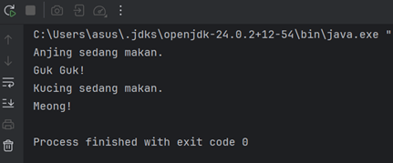

#### Dasar Teori
Interface adalah blueprint yang berisi kumpulan method yang harus diimplementasikan oleh class lain. Interface digunakan untuk mendefinisikan kontrak (contract).
Ciri utama interface:
* Method bersifat abstrak secara default
* Sejak Java 8 dapat memiliki method default dan static
* Tidak memiliki constructor
* Hanya memiliki atribut berupa konstanta (public static final)
Interface digunakan untuk mendefinisikan kemampuan yang dapat dimiliki oleh berbagai class yang berbeda.

#### Langkah praktikum
1. Buat sub-package antarmuka.
2. Buat interface Bergerak.
3. Buat class Mobil dan Pesawat yang mengimplementasikan interface.
4. Implementasikan method dari interface.
5. Buat class Main.
6. Jalankan program.

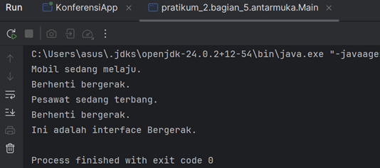

#### Dasar Teori
Berikut perbedaan yang lebih tepat dan sesuai konsep Java:
1. Keyword
Abstract class menggunakan abstract class, sedangkan interface menggunakan interface.
2. Method
Abstract class dapat memiliki method abstrak dan konkret, sedangkan interface secara default hanya memiliki method abstrak (Java 8+ mendukung method default dan static).
3. Atribut
Abstract class dapat memiliki atribut dengan berbagai tipe (non-static maupun static), sedangkan interface hanya memiliki konstanta (public static final).
4. Constructor
Abstract class dapat memiliki constructor, sedangkan interface tidak memiliki constructor.
5. Inheritance
Class hanya dapat mewarisi satu abstract class (single inheritance), sedangkan class dapat mengimplementasikan banyak interface (multiple inheritance).
6. Penggunaan
Abstract class digunakan untuk hubungan “is-a” (misalnya: Kucing adalah Hewan), sedangkan interface digunakan untuk mendefinisikan kemampuan atau perilaku “can-do” (misalnya: Bergerak, Terbang).

## Kapan Menggunakan Abstract Class dan Interface
1. Gunakan Abstract Class Jika:
* Anda ingin membuat blueprint untuk class-class yang memiliki perilaku dan atribut yang sama.
* Anda ingin memiliki method konkret yang dapat diwarisi oleh subclass.
* Anda ingin mengontrol state objek melalui atribut non-static.

2. Gunakan Interface Jika:
* Anda ingin mendefinisikan kontrak atau kemampuan yang harus diimplementasikan oleh class-class yang berbeda.
* Anda ingin mendukung multiple inheritance (sebuah class bisa mengimplementasikan banyak interface).
* Anda ingin menambahkan fungsionalitas tambahan ke class tanpa mengubah struktur class tersebut (menggunakan method default di Java 8+).
* Dalam Sebuah program, kita juga dapat mengkombinasikan abstract class dengan interface.

#### Langkah praktikum
1. Didalam package bagian_5, buatlah sebuah class baru dan beri nama Main dan jalankan program.

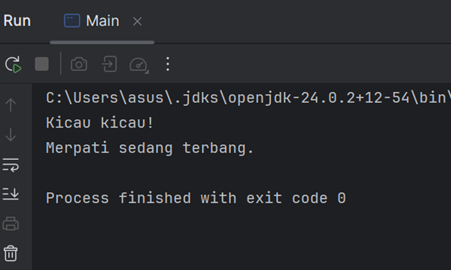

#### Latihan - hewan
1.	Buat package baru untuk latihan.
2.	Buat interface Berenang dengan method berenang().
3.	Buat abstract class HewanAir yang memiliki atribut nama dan method abstrak makan().
4.	Buat class Ikan yang mewarisi HewanAir dan mengimplementasikan Berenang.
5.	Implementasikan method berenang() dan makan() pada class Ikan.
6.	Buat class Main untuk membuat objek Ikan dan menjalankan method.
7.	Jalankan program dan amati hasilnya.

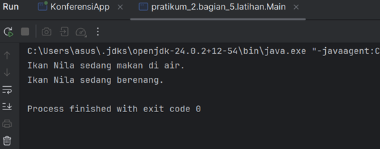

#### Analisa dan Pembahasan
* Abstract class digunakan sebagai dasar class lain
* Interface digunakan sebagai kontrak
* Program menjadi lebih sederhana dan mudah dikembangkan
Abstraction membantu dalam menyederhanakan kompleksitas sistem.

### bagian_6 - Aplikasi Console Pemesanan Tiket Sederhana
#### Dasar Teori
seluruh konsep OOP diterapkan dalam sebuah aplikasi nyata.
Secara teori, OOP memiliki empat pilar utama:
1. Encapsulation
2. Inheritance
3. Polymorphism
4. Abstraction

Penerapan konsep ini dalam aplikasi bertujuan untuk:
* Membuat program lebih modular
* Memudahkan pengelolaan kode
* Mengurangi duplikasi
* Meningkatkan fleksibilitas
Dengan menggabungkan semua konsep OOP, program menjadi lebih terstruktur dan sesuai dengan prinsip pengembangan perangkat lunak modern.

#### Langkah Praktikum
1. Buat package bagian_6.
2. Buat class Tiket (abstract class).
3. Buat class TiketReguler dan TiketVIP.
4. Buat class Pesanan.
5. Buat class KonferensiApp sebagai main program.
6. Implementasikan fitur pemesanan tiket.
7. Jalankan program dan uji semua fitur.

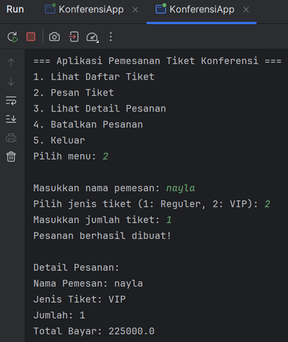

#### Analisa dan Pembahasan
1. Fitur Apliaksi:
* Lihat Daftar Tiket: Menampilkan jenis tiket dan harganya.
* Pesan Tiket: Memungkinkan pengguna memesan tiket dengan memilih jenis dan jumlah.
* Lihat Detail Pesanan: Menampilkan detail pesanan berdasarkan nomor pesanan.
* Batalkan Pesanan: Menghapus pesanan berdasarkan nomor pesanan.
* Hitung Total Harga: Menghitung total harga setelah diskon (jika ada).

2. Penjelasan Program:
* Encapsulation: Atribut seperti jenis dan harga dienkapsulasi dalam class Tiket.
* Inheritance: TiketReguler dan TiketVIP mewarisi class Tiket.
* Polymorphism: Method hitungDiskon() di-override di subclass.
* Abstraction: Class Tiket adalah abstract class dengan method abstrak hitungDiskon().
Aplikasi ini siap digunakan dan dapat dikembangkan lebih lanjut dengan menambahkan fitur seperti penyimpanan data ke file atau database.

---

## 3. Kesimpulan
Berdasarkan praktikum yang telah dilakukan, dapat disimpulkan bahwa Object-Oriented Programming (OOP) merupakan paradigma pemrograman yang berorientasi pada objek, di mana setiap objek memiliki atribut dan method untuk merepresentasikan suatu entitas dalam program .
Dalam modul ini, telah dipelajari berbagai konsep utama OOP, yaitu class dan object, encapsulation, inheritance, polymorphism, abstraction, serta composition. Setiap konsep memiliki peran penting dalam membangun program yang lebih terstruktur dan efisien.

Penerapan konsep-konsep tersebut menunjukkan bahwa:
* Encapsulation membantu menjaga keamanan data
* Inheritance memungkinkan penggunaan kembali kode
* Polymorphism memberikan fleksibilitas dalam penggunaan method
* Abstraction menyederhanakan sistem yang kompleks
Selain itu, penggunaan OOP memberikan berbagai keuntungan seperti modularitas, kemudahan pengembangan, serta kemudahan dalam pemeliharaan program

---

## 5. Referensi
* DosenIT. (2021). Abstract Class vs Interface Java. Diakses dari: Abstract Class vs Interface Java
* GeeksforGeeks. (2024). Difference Between Abstract Class and Interface in Java. Diakses dari: https://www.geeksforgeeks.org/java/difference-between-abstract-class-and-interface-in-java/
* Guru99. (2024). Perbedaan Antara Kelas Abstrak dan Antarmuka di Java. Diakses dari: Interface vs Abstract Class Java
* Wikipedia. (2025). Interface (Java). Diakses dari: Interface (Java)
* Caramantap. (2023). Perbedaan Abstract Class dan Interface. Diakses dari: Perbedaan Abstract Class dan Interface

---