# Laporan praktikum 4: SOLID Principle : Single Responsibility Principle (SRP)
**Mata Kuliah:** [Parikum Desain Pattern]
**Nama:** [NAYLA RAMADHANI]  
**NIM:** [2024573010041]  
**Kelas:** [TI / 2A]

----

## 1. Abstrak
#### Open-Closed Principle (OCP) merupakan salah satu prinsip dalam SOLID yang menyatakan bahwa software entities (class, module, function) harus terbuka untuk pengembangan (extension), tetapi tertutup untuk perubahan (modification).

## 2. Praktikum_4 - Membuat Program Report Manager
### bagian_1 - tanpa_ocp
#### Dasar Teori
Pada implementasi tanpa OCP, sebuah class biasanya menangani banyak fungsi sekaligus seperti:
* membuat laporan
* menyimpan laporan
* mencetak laporan
Akibatnya, jika ingin menambahkan fitur baru, developer harus mengubah class tersebut. Hal ini bertentangan dengan prinsip OCP yang mengharuskan sistem dikembangkan tanpa mengubah kode yang sudah ada.

#### Langkah Praktikum
1. Membuat class ReportManager

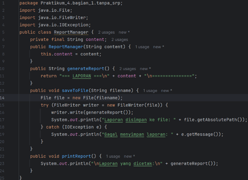

2.  Membuat class Main

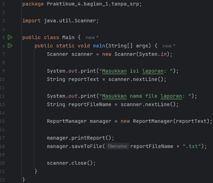

#### Analisa dan Pembahasan
Pada implementasi ini, class ReportManager memiliki beberapa fungsi sekaligus:
* generate report
* save report
* print report
Semua fungsi berada dalam satu class, sehingga menimbulkan beberapa masalah:
* Melanggar OCP → setiap penambahan fitur harus mengubah class
* Tidak fleksibel → sulit menambahkan fitur baru
* Risiko bug tinggi → perubahan bisa merusak fungsi lain
* Tidak modular → semua logic bercampur dalam satu class

### bagian_1 - dengan_ocp
#### Dasar Teori
Untuk menerapkan OCP, sistem harus dirancang agar:
* bisa ditambahkan fitur baru
* tanpa mengubah kode lama
Biasanya menggunakan:
* abstraksi (interface / abstract class)
* polymorphism
Dengan cara ini, kita cukup menambah class baru tanpa mengubah class yang sudah ada

#### Langkah Praktikum
1. Membuat class ReportGenerator

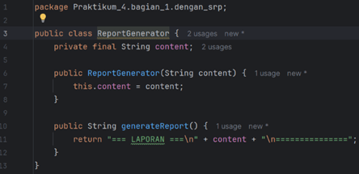

2. Membuat class ReportSaver

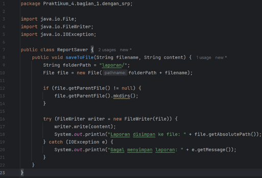

3. Membuat class ReportPrinter

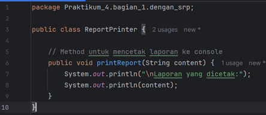

4. Membuat class Main

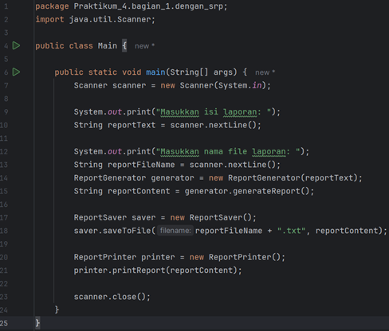

#### Analisa dan Pembahasan
fungsi dipisahkan ke beberapa class:
* ReportGenerator → membuat laporan
* ReportSaver → menyimpan laporan
* ReportPrinter → mencetak laporan
Keuntungan:
* Tidak perlu mengubah class lama
* Mudah menambahkan fitur baru
* Lebih modular dan terstruktur

## 3. Praktikum_4 - Membuat Program Manajemen Pengguna
### bagian_2 - tanpa_ocp
#### Dasar Teori
Tanpa OCP, semua proses user digabung dalam satu class, seperti:
* registrasi user
* simpan ke database
* kirim email
Hal ini menyebabkan class memiliki banyak tanggung jawab.

#### Langkah Praktikum
1. Membuat class UserManager

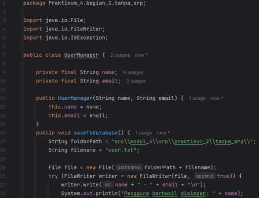
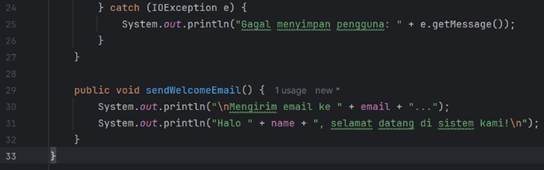

2. Membuat class Main

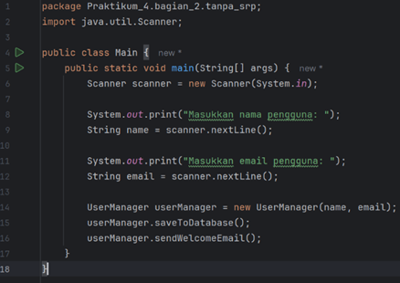

#### Analisa dan Pembahasan
Pada UserManager, semua fungsi digabung:
* tambah user
* simpan data
* kirim email
Masalah:
* Harus mengubah class jika ada fitur baru
* Tidak fleksibel
* Melanggar OCP

### bagian_2 - dengan_ocp
#### Dasar Teori
Dengan OCP, sistem dipisahkan menjadi beberapa bagian agar:
* mudah dikembangkan
* tidak perlu mengubah kode lama

#### Langkah Praktikum
1. Membuat class User

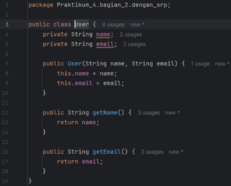

2. Membuat class UserRepository

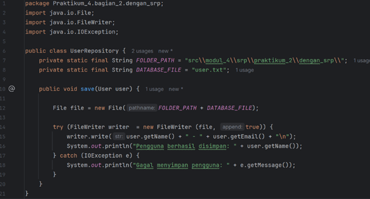

3. Membuat class UserService

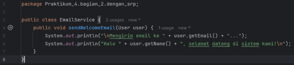

4. Membuat class Main
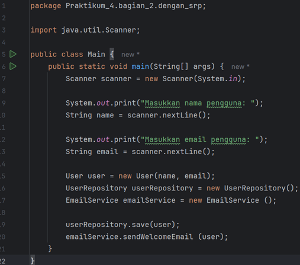

#### Analisa dan Pembahasan
Pada versi ini:
* User → data user
* UserRepository → penyimpanan
* UserService → proses bisnis
Keuntungan:
* Mudah menambah fitur baru
* Tidak perlu ubah class lama
* Lebih rapi dan modular

#### Latihan - Program Manajemen Pesanan (Order Management)
#### Dasar Teori
Jika satu class menangani:
* proses pesanan
* penyimpanan
* pencetakan
Maka akan melanggar OCP karena setiap perubahan harus mengubah class tersebut.

#### Langkah Praktikum
1. Membuat class OrderManager

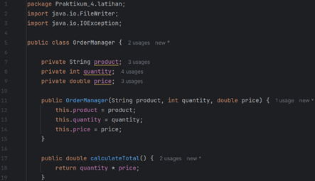
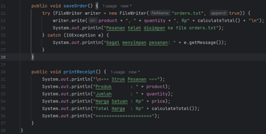

2. Membuat class Main

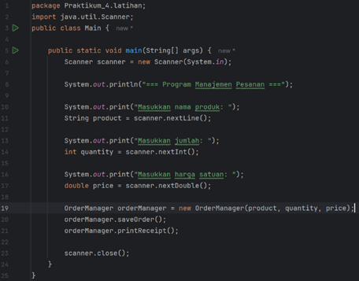

#### Analisa dan Pembahasan
Pisahkan menjadi:
* Order → data
* OrderProcessor → proses
* OrderRepository → penyimpanan
* OrderPrinter → output
Keuntungan:
* Tidak mengubah kode lama
* Mudah menambah fitur
* Sistem lebih fleksibel
---

## 3. Kesimpulan
Open-Closed Principle (OCP) memungkinkan sistem dikembangkan tanpa mengubah kode yang sudah ada. Dengan menerapkan prinsip ini, kode menjadi lebih fleksibel, modular, dan mudah dipelihara.
Namun, jika diterapkan secara berlebihan, dapat menyebabkan banyak class sehingga sistem menjadi lebih kompleks. Oleh karena itu, penerapan OCP harus disesuaikan dengan kebutuhan proyek.

---

## 5. Referensi
1. Open-Closed Principle – Wikipedia https://en.wikipedia.org/wiki/Open%E2%80%93closed_principle
2. Reflectoring – The Open-Closed Principle Explained https://reflectoring.io/open-closed-principle-explained/
3. TechTarget – SOLID Principles https://www.techtarget.com/searchapparchitecture/feature/An-intro-to-the-5-SOLID-principles-of-object-oriented-design
4. DevIQ – Open-Closed Principle https://deviq.com/principles/open-closed-principle/
5. DeveloperExperience – SOLID Principle https://developerexperience.io/articles/solid
6. Principles Wiki – Open-Closed Principle https://principles-wiki.net/principles%3Aopen-closed_principle

---