# Laporan praktikum 5: SOLID Principle : Open-Closed Principle (OCP)
**Mata Kuliah:** [Parikum Desain Pattern]
**Nama:** [NAYLA RAMADHANI]  
**NIM:** [2024573010041]  
**Kelas:** [TI / 2A]

----

## 1. Abstrak
#### Open-Closed Principle (OCP) merupakan salah satu prinsip dalam SOLID yang menyatakan bahwa software entities seperti class, module, dan function harus terbuka untuk pengembangan (extension), tetapi tertutup untuk perubahan (modification).
Prinsip ini pertama kali diperkenalkan oleh Bertrand Meyer dan kemudian dipopulerkan oleh Robert C. Martin (Uncle Bob) dalam konsep SOLID.
Tujuan utama OCP adalah agar sistem dapat dikembangkan dengan menambahkan fitur baru tanpa harus mengubah kode yang sudah ada. Dengan demikian, risiko kesalahan dapat diminimalkan dan sistem menjadi lebih fleksibel serta mudah dipelihara.

## 2. Praktikum_5 - Aplikasi Sistem Pembayaran
### bagian_1 - tanpa_ocp
#### Dasar Teori
Pada implementasi tanpa OCP, sebuah class menangani berbagai jenis logika dalam satu tempat, biasanya menggunakan percabangan seperti if-else.
Pendekatan ini menyebabkan:
* setiap penambahan fitur baru harus mengubah kode lama
* sistem menjadi tidak fleksibel
Hal ini bertentangan dengan prinsip OCP yang menekankan bahwa penambahan fitur seharusnya dilakukan tanpa mengubah kode yang sudah ada.

#### Langkah Praktikum
1. Buat class baru di dalam tanpa_ocp dengan nama PaymentProcessor

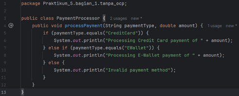

2. Buat class Main dan jalankan program

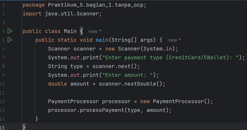

#### Analisa dan Pembahasan
Pada class PaymentProcessor:
* Semua metode pembayaran (misalnya kartu kredit, e-wallet) diproses dalam satu class
* Menggunakan banyak kondisi (if-else)
Masalah:
* Melanggar OCP
* Sulit dikembangkan
* Risiko bug tinggi
Jika ingin menambahkan metode pembayaran baru seperti QRIS, maka harus mengubah class PaymentProcessor.

### bagian_1 - dengan_ocp
#### Dasar Teori
Untuk menerapkan OCP, digunakan:
* interface
* polymorphism
Dengan pendekatan ini:
* perilaku sistem dapat diperluas tanpa mengubah kode lama
* cukup menambahkan class baru yang mengimplementasikan interface
Konsep ini memungkinkan sistem lebih fleksibel dan scalable.

#### Langkah Praktikum
1. Buat sebuah interface dengan nama PaymentMethod

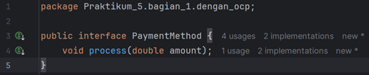

2. Buat sebuah class dengan nama CreditCardPayment

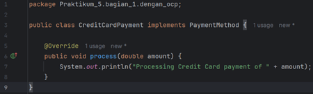

3. Buat sebuah class dengan nama EWalletPayment

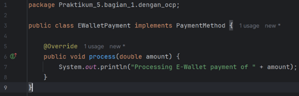

4. Buat sebuah class dengan nama PaymentProcessor

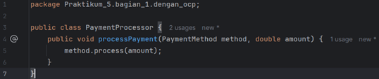

5. Buat sebuah class Main dan jalankan program

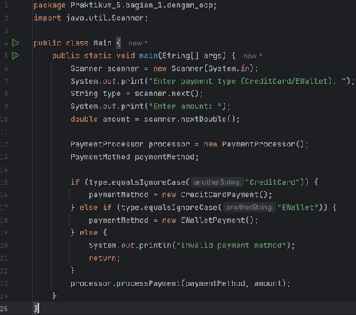

#### Analisa dan Pembahasan
Struktur program:
* PaymentMethod (interface)
* CreditCardPayment
* EWalletPayment
* PaymentProcessor
Keuntungan:
* Tidak perlu ubah kode lama
* Mudah tambah metode baru
* Lebih modular
Menambahkan QRISPayment hanya perlu membuat class baru tanpa mengubah class lain.

## 3. Praktikum_5 - Sistem Perhitungan Diskon
### bagian_2 - tanpa_ocp
#### Dasar Teori
Pada sistem tanpa OCP, perhitungan diskon dilakukan dalam satu class menggunakan kondisi berdasarkan jenis pelanggan.
Pendekatan ini menyebabkan:
* kode sulit dikembangkan
* setiap perubahan harus memodifikasi class

#### Langkah Praktikum
1. Buat class baru di dalam tanpa_ocp dengan nama DiscountCalculator

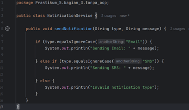

2. Buat class Maindan jalankan program

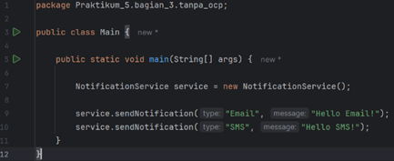

#### Analisa dan Pembahasan
Masalah:
* Banyak percabangan
* Tidak fleksibel
* Melanggar OCP
Jika ingin menambahkan jenis diskon baru: ➡ harus mengubah class DiscountCalculator

### bagian_2 - dengan_ocp
#### Dasar Teori
Dengan OCP, digunakan interface Discount untuk memisahkan logika perhitungan diskon.
Setiap jenis diskon dibuat dalam class terpisah sehingga sistem dapat diperluas tanpa mengubah kode lama.

#### Langkah Praktikum
1. Buat sebuah interface dengan nama Discount

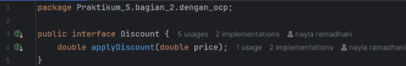

2. Buat sebuah class dengan nama RegularDiscount

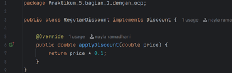

3. Buat sebuah class dengan nama PremiumDiscount

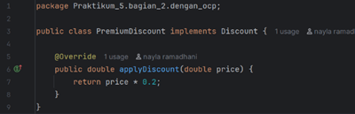

4. Buat sebuah class dengan nama DiscountCalculator

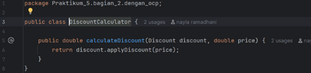

5. Buat sebuah class Main dan jalankan program

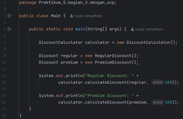

#### Analisa dan Pembahasan
Struktur:
* Discount (interface)
* RegularDiscount
* PremiumDiscount
  Keuntungan:
* Mudah menambahkan jenis diskon baru
* Tidak perlu mengubah kode lama
* Lebih fleksibel

## 4. Praktikum_5 - Sistem Notifikasi
### bagian_1 - tanpa_ocp
#### Dasar Teori
Tanpa OCP, semua jenis notifikasi (email, SMS, dll) ditangani dalam satu class dengan banyak kondisi.
Hal ini menyebabkan:
* sistem sulit dikembangkan
* perubahan kecil berdampak besar

#### Langkah Praktikum
1. Buat class baru di dalam tanpa_ocp dengan nama NotificationService

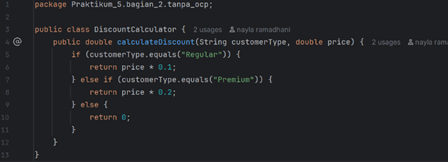

2. Buat class Main dan jalankan program

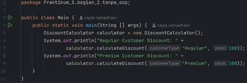

#### Analisa dan Pembahasan
Masalah:
* Banyak if-else
* Tidak modular
* Melanggar OCP

### bagian_1 - dengan_ocp
#### Dasar Teori
Dengan OCP, digunakan interface Notifier untuk memisahkan jenis notifikasi.
Setiap jenis notifikasi dibuat dalam class tersendiri.

#### Langkah Praktikum
1. Buat sebuah interface dengan nama Notifier

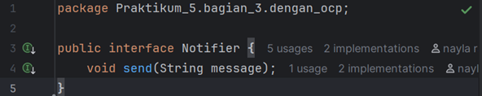

2. Buat sebuah class dengan nama EmailNotifier

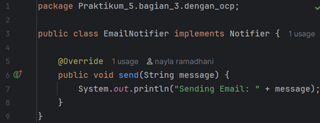

3. Buat sebuah class dengan nama SMSNotifier

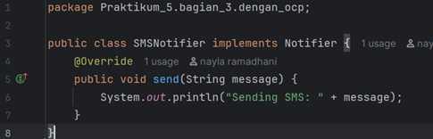

4. Buat sebuah class dengan nama NotificationService

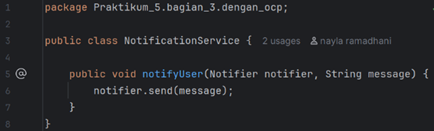

5. Buat sebuah class Main dan jalankan program

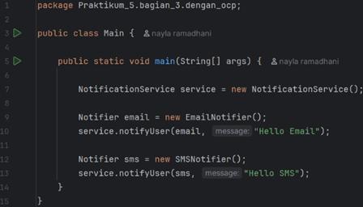

#### Analisa dan Pembahasan
Struktur:
* Notifier
* EmailNotifier
* SMSNotifier
Keuntungan:
* Mudah menambahkan notifikasi baru
* Tidak mengubah kode lama
* Sistem lebih fleksibel
* Menambahkan WhatsAppNotifier hanya perlu menambah class baru.

#### Latihan - Sistem Pengelolaan Pajak
#### Dasar Teori
Program awal menggunakan kondisi berdasarkan jenis kendaraan sehingga melanggar OCP.

#### Langkah Praktikum
1. Gunakan polimorfisme dengan membuat interface TaxStrategy.

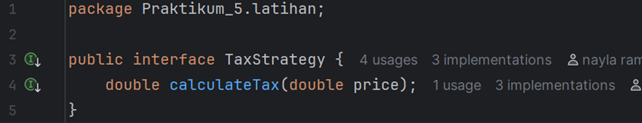

2. Buat class CarTax dan MotorcycleTax yang mengimplementasikan TaxStrategy.

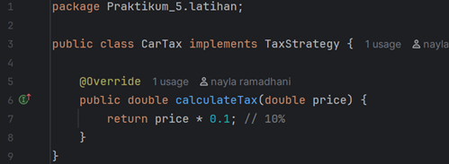

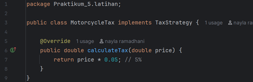

3. Ubah TaxCalculator agar menerima strategi pajak sebagai parameter, bukan langsung menerima vehicleType.

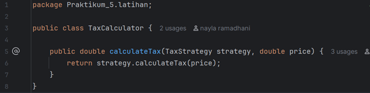

4. Tambahkan kelas baru TruckTax (dengan pajak 15%) tanpa mengubah TaxCalculator.

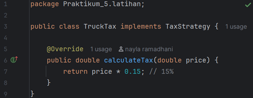

5. Buat class main untuk menjalankan program dan tampilkan hasilnya

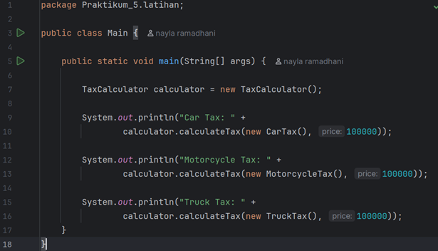

#### Analisa dan Pembahasan
Masalah:
* Menggunakan if-else berdasarkan jenis kendaraan
* Harus mengubah method jika ada jenis baru.

Struktur:
* TaxStrategy (interface)
* CarTax
* MotorcycleTax
* TruckTax
  Keuntungan:
* Tidak perlu mengubah TaxCalculator
* Mudah menambah jenis kendaraan
* Lebih fleksibel
---

## 3. Kesimpulan
Open-Closed Principle (OCP) merupakan prinsip penting dalam pengembangan perangkat lunak karena memungkinkan sistem untuk berkembang tanpa mengubah kode yang sudah ada.
Dengan menerapkan OCP:
* kode menjadi lebih fleksibel
* mudah dikembangkan
* risiko bug berkurang
Namun, penggunaan OCP juga harus seimbang karena dapat menambah jumlah class dan kompleksitas sistem.

---

## 5. Referensi
1. https://en.wikipedia.org/wiki/Open%E2%80%93closed_principle
2. https://embeddedartistry.com/fieldmanual-terms/open-closed-principle/
3. https://www.cs.sjsu.edu/~pearce/modules/lectures/ood/principles/ocp.htm
4. https://www.javaguides.net/2018/02/open-closed-principle.html
5. https://www.alpharithms.com/open-closed-principle-ocp-solid-263212/

---